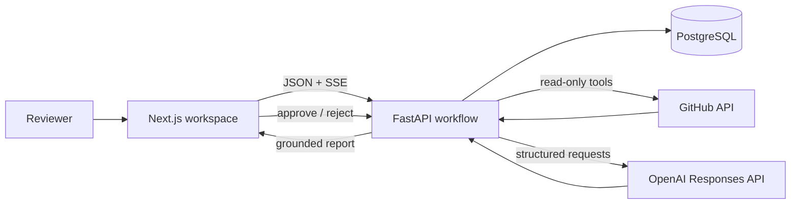

# Task Investigator

An explainable engineering agent that turns a GitHub Issue into an evidence-backed frontend implementation plan. It retrieves only the required repository context, cites every material claim, and pauses at a human approval checkpoint.

> 中文說明請見下方「中文摘要」。

## Why this exists

Requirement analysis often means manually jumping between an Issue, repository search, old pull requests, and CI. Task Investigator turns that scattered investigation into one observable workflow without allowing the model to mutate GitHub.

```text
GitHub Issue → Plan → Code search → File inspection → PR/CI context
             → Structured report → Human approval → Audit event
```

## Product behavior

- **Replay mode:** deterministic, zero-cost portfolio demo that works without external credentials.
- **Live mode:** allowlisted GitHub repository analysis using read-only tools and OpenAI Responses API.
- **Grounding:** impacted files, tasks, and risks require source citations; unsupported claims are labelled inference.
- **Human control:** approval and rejection are stored locally. Version 0.1 never writes to GitHub.
- **Observable execution:** SSE streams workflow state, summaries, tool latency, token usage, and failure status.
- **API Analyzer:** pasted OpenAPI 3.x JSON/YAML is converted into endpoint summaries, contract gaps, clarification questions, and a frontend integration checklist.
- **Bug Investigator:** error, Console, and Network evidence is matched with read-only repository context to produce ranked hypotheses and verification actions—not an unverified fix.

## Architecture

- Web: Next.js 16, React 19, TypeScript
- API: Python 3.12, FastAPI, Pydantic
- Data: PostgreSQL, SQLAlchemy, Alembic
- AI: OpenAI Responses API with Pydantic Structured Outputs
- External tools: GitHub REST API, server-side read-only allowlist
- Local infrastructure: Docker Compose
- Deployment targets: Vercel (web), Render (API and PostgreSQL)

The web surface lives at the repository root for a standard Vercel-compatible Next.js build. The independently deployable backend lives in `apps/api`.



The model never receives the GitHub token. FastAPI owns the tool allowlist, file limits, state transitions, persistence, and approval boundary.

## Prerequisites

Install these before starting:

- Node.js 22.13 or newer and npm
- Docker Desktop with Docker Compose
- Git
- Python 3.12 or newer only if you want to run the API without Docker

Verify the required commands:

```bash
node --version
npm --version
docker --version
docker compose version
```

## Quick start

The recommended local setup runs PostgreSQL and FastAPI in Docker, while Next.js runs directly on your machine for fast frontend reloads.

### 1. Open the project

```bash
cd "/Users/leochang/Desktop/frontend-task-investigator"
```

If the project was cloned elsewhere, replace the path with your clone location.

### 2. Create the local environment file

```bash
cp .env.example .env
```

Replay Mode does not need a GitHub token or OpenAI API key. Leave both values empty until you configure Live Mode.

### 3. Start PostgreSQL and FastAPI

```bash
docker compose up --build
```

Keep this terminal open. Wait until the API reports that it is running, then verify:

- API health: `http://localhost:8000/health`
- API documentation: `http://localhost:8000/docs`

### 4. Start Next.js in a second terminal

```bash
cd "/Users/leochang/Desktop/frontend-task-investigator"
npm ci
npm run dev
```

Open `http://localhost:3000`, keep **Replay** selected, and click **Run analysis**. The fixed replay case should reach `waiting approval`, after which you can approve or reject the draft.

### 5. Stop the project

Stop Next.js with `Control-C` in its terminal. Stop the API and PostgreSQL with:

```bash
docker compose down
```

To also delete the local PostgreSQL volume and all investigation records:

```bash
docker compose down --volumes
```

The `--volumes` command deletes local database data and cannot be undone.

## Run without Docker

Use this option when Docker Desktop is unavailable. The API defaults to a local SQLite database.

Terminal 1 — FastAPI:

```bash
cd "/Users/leochang/Desktop/frontend-task-investigator/apps/api"
cp .env.example .env
python3 -m venv .venv
source .venv/bin/activate
pip install -r requirements.txt
uvicorn app.main:app --reload --port 8000
```

For Live Mode, fill in `apps/api/.env`. For Replay Mode, the placeholder credentials can remain empty.

Terminal 2 — Next.js:

```bash
cd "/Users/leochang/Desktop/frontend-task-investigator"
npm ci
npm run dev
```

## Local setup details

### Replay-only development

Replay Mode uses a deterministic stored result and does not call GitHub or OpenAI. It is the recommended interview path because it has no network, credential, API-cost, or rate-limit dependency.

The API is available at `http://localhost:8000`; interactive documentation is at `/docs`.

### Live mode

Set these only in your local `.env` and hosting provider secrets:

```env
GITHUB_ALLOWED_REPOS=your-user/frontend-agent-demo-shop
GITHUB_TOKEN=your-fine-grained-read-only-token
OPENAI_API_KEY=your-api-key
OPENAI_MODEL=gpt-5.6-terra
```

Never commit tokens. The GitHub token needs repository Contents, Issues, Pull Requests, and Actions read access only.

The portfolio demo uses `c-y-s-s/frontend-agent-demo-shop`. Live Issue #1 covers payment retries and Issue #4 covers cart persistence.

Restart the API after changing `.env`. In the UI, select **Live**, enter the allowlisted `owner/repository`, Issue number, and branch, then start the investigation.

## Troubleshooting

### The page opens but Run analysis fails

Confirm FastAPI is running:

```bash
curl http://localhost:8000/health
```

If the request fails, restart `docker compose up --build` or the local `uvicorn` process.

### Port 3000 or 8000 is already in use

Stop the previous Next.js, FastAPI, or Docker process before restarting. The frontend currently expects the API at `http://localhost:8000`.

### Live Mode returns repository not allowed

Set `GITHUB_ALLOWED_REPOS` to the exact lowercase-compatible `owner/repository` value, then restart FastAPI.

### Live Mode fails but Replay works

Check that `GITHUB_TOKEN` has read access to Contents, Issues, Pull Requests, and Actions, and confirm that `OPENAI_API_KEY` has API billing enabled. ChatGPT subscriptions do not provide API credit.

### Reset the local SQLite database

When running without Docker, stop FastAPI and remove `apps/api/investigator.db`. This deletes all local investigations and approvals.

## API contract

| Method | Path | Behavior |
|---|---|---|
| POST | `/api/v1/investigations` | Creates replay or live analysis |
| GET | `/api/v1/investigations/{id}` | Returns current state and report |
| GET | `/api/v1/investigations/{id}/events` | Streams state changes with SSE |
| POST | `/api/v1/investigations/{id}/approve` | Stores approved report and audit event |
| POST | `/api/v1/investigations/{id}/reject` | Stores rejection reason and audit event |
| POST | `/api/v1/api-analyses` | Starts Replay or Live Response JSON / OpenAPI analysis |
| GET | `/api/v1/api-analyses/{id}` | Returns API analysis state and report |
| GET | `/api/v1/api-analyses/{id}/events` | Streams API analysis state with SSE |
| POST | `/api/v1/api-analyses/{id}/approve` | Approves an API analysis report |
| POST | `/api/v1/api-analyses/{id}/reject` | Rejects an API analysis report |
| POST | `/api/v1/bug-investigations` | Starts Replay or Live bug investigation |
| GET | `/api/v1/bug-investigations/{id}` | Returns bug investigation state and report |
| GET | `/api/v1/bug-investigations/{id}/events` | Streams bug investigation state with SSE |
| POST | `/api/v1/bug-investigations/{id}/approve` | Approves an investigation direction |
| POST | `/api/v1/bug-investigations/{id}/reject` | Rejects an investigation direction |
| GET | `/health` | Deployment health check |

## API Analyzer

Open `http://localhost:3000/api-analyzer`. The default Response JSON mode accepts one API response sample plus optional method, path, a short feature-purpose description, and **Known API contract / rules**. Use that last field for facts you already know, such as enum values, pagination query names and limits, nullable rules, authentication, date format, or the error-response shape. The Agent lists which user-provided rules it used and avoids asking questions those notes already answer.

Known-contract notes are context, not evidence discovered from Swagger. Do not paste credentials or tokens. Common secret patterns are redacted before Live AI, and both the original response JSON and raw contract notes are cleared from persistence when the analysis finishes. The structured report retains only the sanitized rules it used.

The prefilled contract is fictional Demo data that answers authentication, pagination errors, unsupported filtering, default sorting, and date formatting. Replace it before analyzing a real endpoint; its values must not be treated as facts about another backend.

The analyzer infers field types and nullability, detects pagination and personal-data fields, produces a TypeScript draft, and separates direct observations from facts that still require backend confirmation. If the report still has questions, ask the backend engineer or PM, add the answers to Known API contract, and run it again.

Switch to OpenAPI Document mode to paste an OpenAPI 3.x JSON or YAML document. Replay performs deterministic checks without OpenAI; Live uses the same bounded and sanitized parser output as evidence for a structured AI report.

The interview MVP intentionally accepts pasted input only. It rejects external `$ref` URLs, caps input at 500 KB, never fetches arbitrary URLs, redacts common personal-data values before Live AI analysis, and clears the source document from persistence after analysis. Generated TypeScript is a draft inferred from observed values, not a formal contract.

## Bug Investigator

Open `http://localhost:3000/bug-investigator`. Supply a bug title, expected behavior, Error message, Console log, and Network Response. Replay demonstrates a fixed payment 503 case; Live searches only the allowlisted GitHub repository, reads bounded candidate files, checks up to three related PRs, and asks OpenAI for at most three ranked hypotheses.

The output intentionally says **possible cause**, not confirmed root cause. Each hypothesis includes evidence and small verification actions with expected signals. The workflow stops at human approval and never edits code, executes arbitrary commands, controls a browser, or creates a pull request. Common tokens and email values are redacted before Live AI, and raw Error/Console/Network input is cleared after the workflow.

## Safety and cost controls

- Live mode accepts only explicitly allowlisted repositories.
- File reads are capped at 7 files and 40 KB per file.
- PR evidence is capped at 3 pull requests and 20 changed-file paths per PR; full patches are never sent to the model.
- Secrets, build output, binaries, lockfiles, and suspicious paths are excluded.
- Live runs have per-IP hourly and global daily limits.
- Model output is schema-validated before persistence.
- OpenAPI input is limited to version 3.x, 500 KB, and local component references.
- The model receives no GitHub token and cannot construct arbitrary HTTP requests.
- Hidden chain-of-thought is never stored or exposed.

The in-process limiter is suitable for this single-instance portfolio MVP. A horizontally scaled deployment needs a shared counter such as Redis or a database-backed quota table.

## Testing

```bash
cd apps/api
python -m venv .venv
source .venv/bin/activate
pip install -r requirements.txt
pytest
```

The suite covers replay completion, citation validation, approval state guards, rejection validation, repository allowlisting, and health checks. External calls are not required.

## Interview demo

Use Replay mode for the reliable 3–5 minute walkthrough:

1. Submit the fixed case and point out the observable Issue → search → files → PR/CI → report timeline.
2. Open one impacted-file citation and one historical-PR citation to show that claims are grounded.
3. Explain that GitHub tools are read-only and capped; the model never receives the GitHub token or a general HTTP tool.
4. Approve the report to demonstrate the human checkpoint and audit state.
5. Show one saved Live result to compare real latency and token usage without risking an interview-time API failure.

For the API Analyzer walkthrough, use the dedicated [Traditional Chinese demo script](docs/api-analyzer-demo.zh-TW.md). It demonstrates the same Response twice—first without known contract notes, then with confirmed rules—so the reviewer can see which questions disappear and why. The expected behavior is recorded in `evals/api-analyzer-response-case.json`.

## Evaluation

Ground truth is stored outside the demo repository in `evals/`, so the Agent cannot discover the answers during code search. The interview-sized evaluation uses two deliberately different tasks:

| Case | Expected files | Related PR | File result | Tokens | Agent time | Human edit |
|---|---:|---:|---|---:|---:|---|
| Issue #1 — payment retry | 5 | #2 | 5/5 found | 7,877 | 44.27 s | Approved unchanged |
| Issue #4 — cart persistence | 4 | #3 | 4/4 found | 8,415 | 46.94 s | Approved unchanged |

For each case, manually record impacted-file precision/recall, whether the expected PR was cited, token usage, summed workflow duration, and whether the draft required edits. Two cases are enough for this portfolio demonstration; the table is not presented as a production benchmark.

The payment result above improved from an earlier 24,691-token run to 7,877 tokens after limiting candidate files and using a focused search-planning step. Replay metrics are fixture values, not pricing claims.

## Known limits

- GitHub Code Search completeness depends on GitHub indexing and token access.
- Search planning uses a small structured model call; semantic repository indexing is intentionally out of scope.
- Free hosting may cold-start. Replay mode remains the reliable interview path.
- Approval records review; it does not update an Issue.

## 中文摘要

Task Investigator 是一個面試作品用的前端工程 Agent。輸入 GitHub Issue 後，系統會依序讀取需求、搜尋程式碼、檢查相關 PR 與 CI，產生附來源連結的影響分析、Task 拆解與風險清單，最後停在人工核准。

第一版刻意不寫回 GitHub：模型只能使用後端允許的唯讀工具；所有寫入行為都留待後續版本。公開展示預設使用 Replay Mode，因此沒有 API Key 也能穩定演示完整流程。Live Mode 僅接受 allowlist 內的 Repo，並限制每次讀取檔案數量、單檔大小、IP 呼叫次數和每日總量。

面試時請強調：這不是單次 Prompt，而是具備工具邊界、狀態管理、來源引用、結構化輸出、人工核准、Audit Log、錯誤處理與評估設計的完整 Agent Workflow。

面試 Demo 建議先使用 Replay Mode 走完 3–5 分鐘流程，再展示已保存的 Live 結果。評估只使用付款重試與購物車持久化兩張 Issue，目的是證明 Agent 能處理不同類型的前端任務，而不是宣稱已達正式產品等級。

第二個模組 API Analyzer 位於 `/api-analyzer`。預設模式讓使用者貼上單支 API 的 Response JSON，並可補充功能用途、Method 與 Path；系統會整理欄位型別、null、分頁、個資風險、TypeScript 草稿與待確認問題。也可切換成 OpenAPI 3.x 文件模式，分析 Endpoint、Request／Response、Authentication 與契約缺漏。MVP 不抓取外部 URL、不解析遠端 `$ref`，也不宣稱單一 Response 範例就是正式契約。
